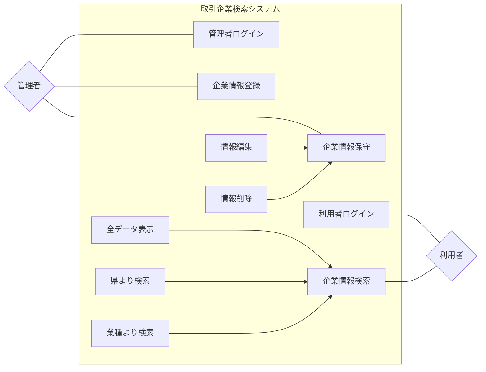

# ユースケース

```mermaid
flowchart LR

A{管理者}
B{利用者}

A ---- C[管理者ログイン]
A ---- D[企業情報登録]
A ----- E[企業情報保守]
F[情報編集] --> E[企業情報保守]
G[情報削除] --> E[企業情報保守]

H[利用者ログイン] --- B
I[企業情報検索] --- B
J[全データ表示] ---> I[企業情報検索]
K[県より検索] ---> I[企業情報検索]
L[業種より検索] ---> I[企業情報検索]


subgraph 取引企業検索システム
  C
  D
  E
  F
  G
  H
  I
  J
  K
  L
end
```

[目次に戻る](要件定義_目次.md)